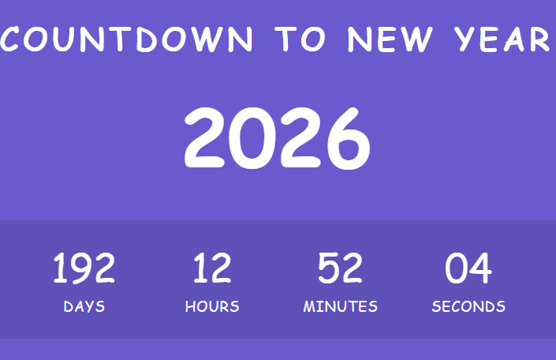

# Countdown to New Year

## Overview
This project is a countdown timer built with HTML, CSS, and JavaScript. It displays the remaining days, hours, minutes, and seconds until the next New Year (January 1 of the following year), updating in real-time.

## ## Screenshots


## Features
- **Real-Time Countdown**: Updates every second until the next New Year.
- **Dynamic Year**: Automatically sets the target year (e.g., 2026 for 2025).
- **Responsive Design**: Adjusts layout for various screen sizes.
- **Modern UI**: Styled with a gradient background and styled countdown boxes.

## Tech Stack
- **HTML5**: For semantic structure.
- **CSS3**: For styling (flexbox, gradients, media queries).
- **JavaScript**: For real-time countdown logic using `setInterval`.

## Installation
1. Clone the repository:
   ```bash
   git clone https://github.com/AliDevHub/countdown-new-year.git


## How It Works
1. The timer displays the remaining time until January 1 of the next year (e.g., 2026).
2. The countdown updates every second and stops when the target date is reached, showing "00:00:00:00".
3. The design features a gradient background with centered countdown boxes.

#### Notes on the README:
<a href="https://alidevhub.github.io/countdown-new-year/">Live Demo</a>
- **Live Demo**: I’ve included a placeholder GitHub Pages URL (`https://alidevhub.github.io/countdown-new-year/`). You’ll need to enable GitHub Pages to make this link work (see Step 4 below).